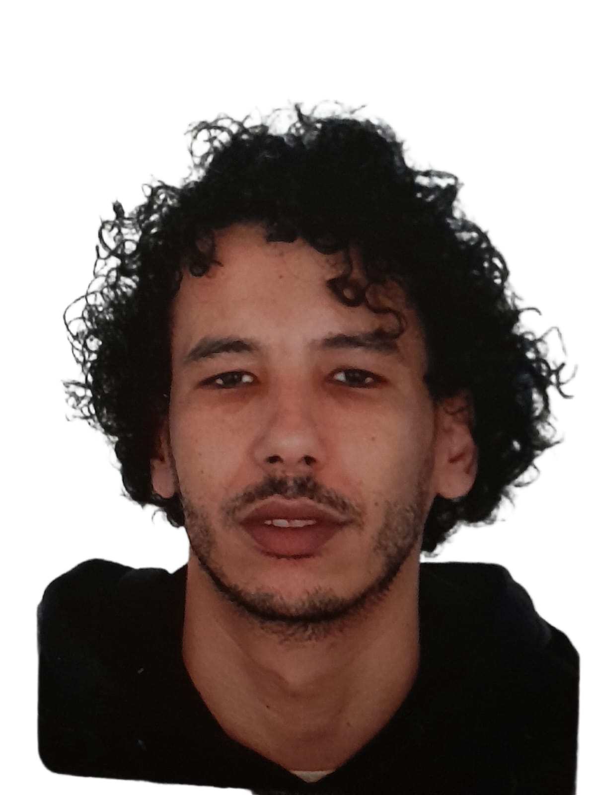

<!-- ===== HERO SECTION CON EFECTOS ESPECTACULARES ===== -->
<section id="heroSection" class="container">
  

    
    <!-- CONTENEDOR DE FOTO CON EFECTOS WOW -->
    

      
      <!-- Efecto vortex -->
      

      

      
      <!-- Efecto ondas sísmicas -->
      

      

      

      
      <!-- Efecto agua -->
      

      

      

      
      <!-- Escáner biológico -->
      

      
      <!-- Partículas flotantes -->
      

      

      

      

      

      
      <!-- Puntos de energía -->
      

      

      

      

      
      <!-- Destellos aleatorios -->
      

      

      

      

      
      <!-- LA FOTO PRINCIPAL -->
      
      
    

    
    

      <h2 data-translate="hero.title" class="holo-title-3d">
        Biólogo
         
        navegando
         
        hacia
         
        la
         
        Informática
      </h2>
      
      

        Después de explorar los sistemas biológicos, ahora cartografío sistemas informáticos. 
        Mi formación científica me da una perspectiva única para resolver problemas tecnológicos: 
        observación, análisis y método.
      

      
      

        <a href="#mapScreen" class="btn-ghost" data-translate="hero.map">
          🚀 Ver mi travesía
        </a>
        <a href="#proyectosSection" class="btn-ghost" data-translate="hero.projects">
          🔬 Proyectos en curso
        </a>
      

    

  

</section>